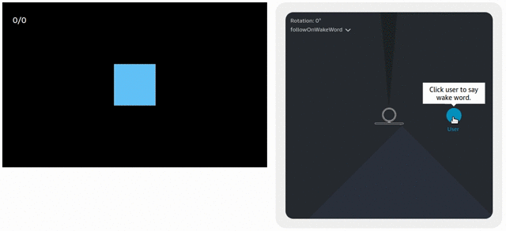
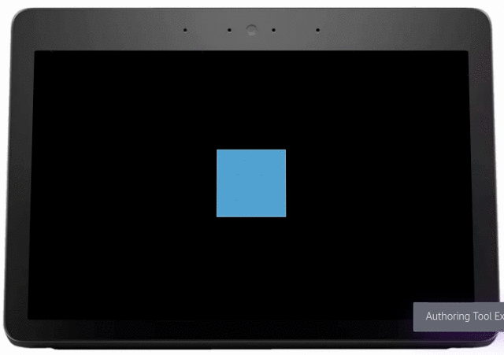

# 3D Cube

Using the new [smart motion extension](https://developer.amazon.com/en-US/docs/alexa/alexa-presentation-language/apl-ext-smart-motion.html), a simple square becomes a 3D cube as the device follows the user.

Also included is an example how to rotate the cube using the [gesture handlers](https://developer.amazon.com/es-ES/docs/alexa/alexa-presentation-language/apl-gestures.html).

## How can I test the example for the smart motion extension?

* [Enable the smart-motion extension](https://developer.amazon.com/en-US/docs/alexa/alexa-presentation-language/apl-ext-smart-motion.html#enable-the-smart-motion-extension)

* Send the content of motion.json in a [RenderDocument directive](https://developer.amazon.com/en-US/docs/alexa/alexa-presentation-language/apl-interface.html#renderdocument-directive)

## How can I test the example for the gesture handlers?

* Copy the content from the gesture.json into the authoring tool