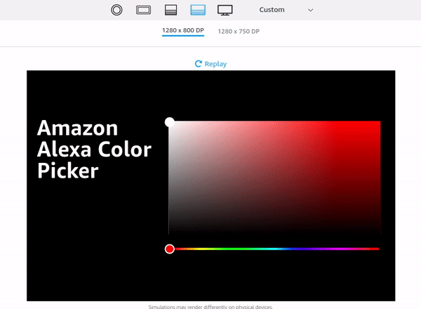

# Alexa Colorpicker

The Colorpicker requires at least APL 1.4, only devices with touch are supported.




## Properties

| Name         | Type   | Default | Description                                                                                                                                                     |
|--------------|--------|---------|-----------------------------------------------------------------------------------------------------------------------------------------------------------------|
| width        | Number | 100     | The width of the colorpicker.                                                                                                                                   |
| height       | Number | 100     | The height of the colorpicker.                                                                                                                                  |
| rgb          | Array  | [255, 255, 255]     | The current set rgb color.                                                                                                                                  |
| colorChanged | Array  | []      | Commands to be executed when the color changes. The commands have access to the following variables: ${hue}, ${saturation}, ${value}, ${red}, ${green}, ${blue} |

## Authoring Tool

Copy the APL document below into the authoring tool to test the colorpicker on your device.

```
{
  "type": "APL",
  "version": "1.4",
  "settings": {},
  "theme": "dark",
  "import": [{
    "name": "colorpicker",
    "version": "1.0.0",
    "source": "https://www.alexandermartin.dev/playground/colorpicker.json"
  }],
  "resources": [],
  "styles": {},
  "onMount": [],
  "graphics": {},
  "commands": {},
  "layouts": {},
  "mainTemplate": {
    "parameters": [
      "payload"
    ],
    "items": [
      {
        "type": "Container",
        "width": "100vw",
        "height": "100vh",
        "alignItems": "center",
        "justifyContent": "center",
        "items": [
          {
            "type": "Container",
            "width": "100%",
            "direction": "row",
            "paddingLeft": "3vw",
            "paddingRight": "3vw",
            "justifyContent": "spaceAround",
            "items": [
              {
                "type": "Container",
                "items": [{
                  "type": "Text",
                  "id": "dummy",
                  "lineHeight": 1,
                  "fontSize": "5.8vw",
                  "fontWeight": "700",
                  "maxWidth": "35vw",
                  "text": "Amazon Alexa Color Picker",
                  "color": "#ffffff"  
                }]
              },
              {
                "type": "ColorPicker",
                "width": "${viewport.width * .6}",
                "height": "${viewport.height * .6}",
                "colorChanged": [
                  {
                    "type": "SetValue",
                    "componentId": "dummy",
                    "property": "color",
                    "value": "rgb(${red}, ${green}, ${blue})"
                  }
                ]
              }
            ]
          }
        ]
      }
    ]
  }
}
```